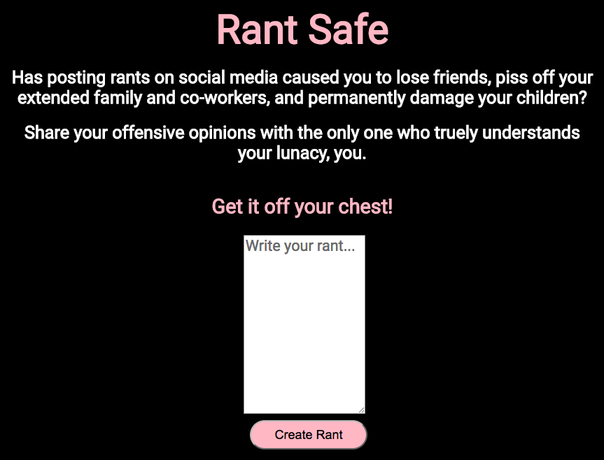
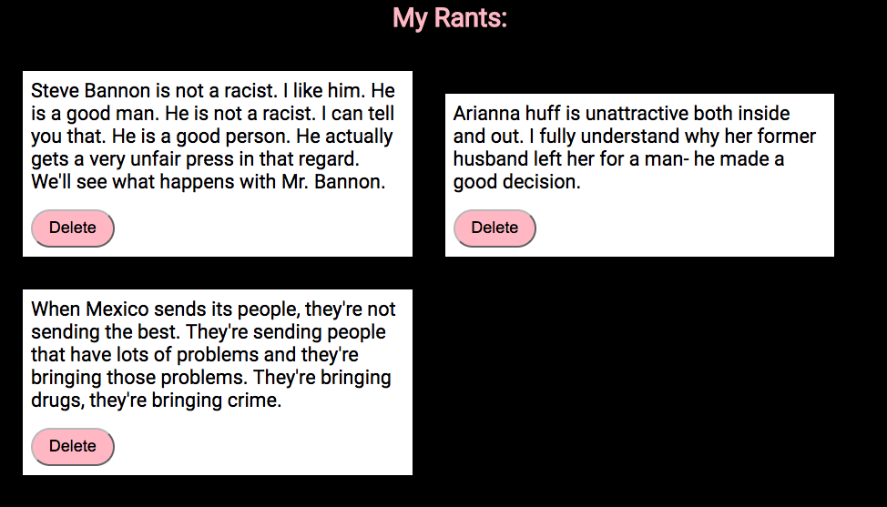

# Dynamic Cards
## Bootcamp Assignment

### Requirements

	1. Create an HTML page that contains a text area and a button labeled Create.

	2. When the user enters in text into the text area and then clicks the create button, create a new card element in the DOM that includes it's own delete button. You decide the height/width of the card.

	3. When the user clicks the Delete button, the containing card, and no other cards, should then be removed from the DOM. Not just made invisible, actually removed from the DOM.

Dynamic-Cards/README.md
