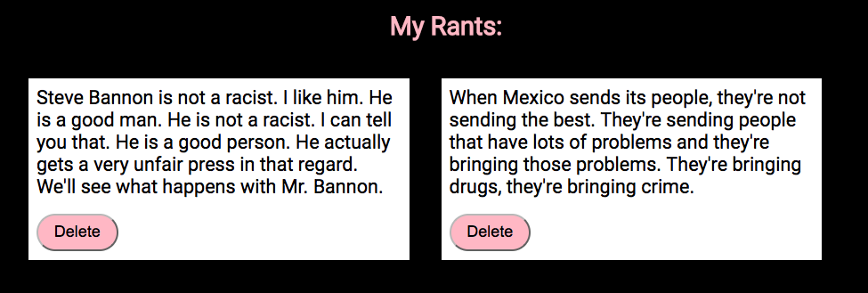

# Dynamic Cards
<<<<<<< HEAD

> Nashville Software School, Full-Stack Dev Bootcamp, Front-End Independant Exercise
> 
=======
## Bootcamp Assignment
>>>>>>> 945bb807b37721eab0a4e0c9927b6da78dcebf49

### Requirements

	1. Create an HTML page that contains a text area and a button labeled Create.


	2. When the user enters in text into the text area and then clicks the create button, create a new card element in the DOM that includes it's own delete button. You decide the height/width of the card.


	3. When the user clicks the Delete button, the containing card, and no other cards, should then be removed from the DOM. Not just made invisible, actually removed from the DOM.


<<<<<<< HEAD
### How to run (Node must be installed on your machine):
```
git clone https://github.com/lady-ace/Dynamic-Cards
cd Dynamic-Cards
npm install http-server -g
http-server -p 8080
```

This will show in your browser at:
`http://localhost:8080`

### Contributors:
[Jessica Brawner](https://github.com/lady-ace)
=======
Dynamic-Cards/README.md
>>>>>>> 945bb807b37721eab0a4e0c9927b6da78dcebf49
